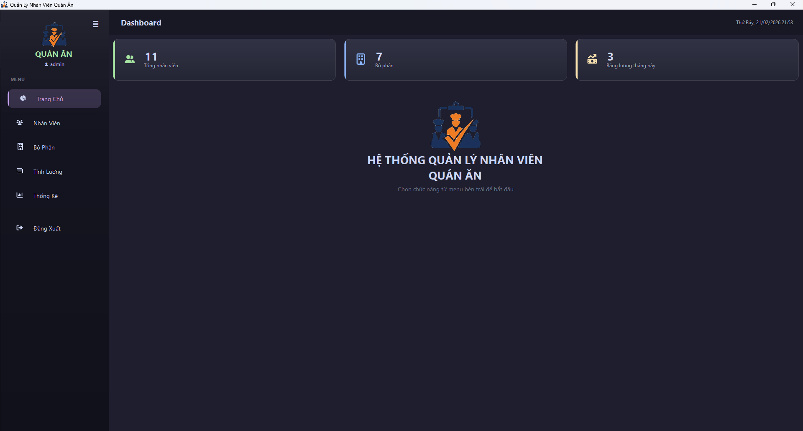
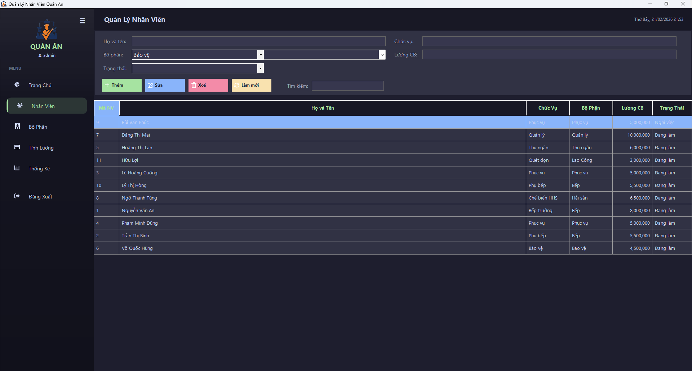
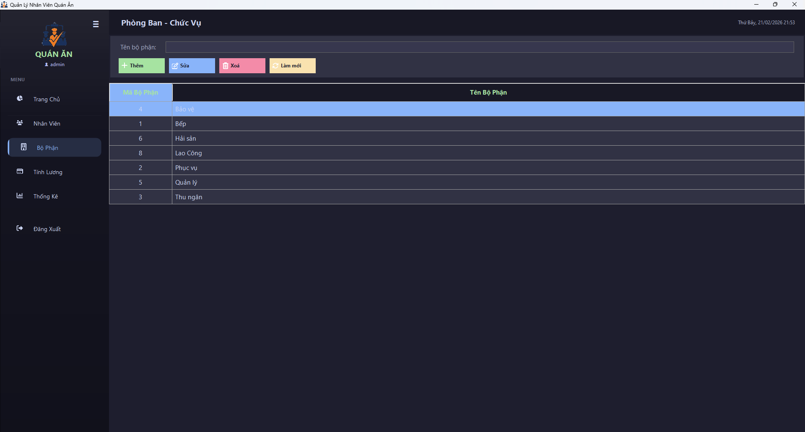
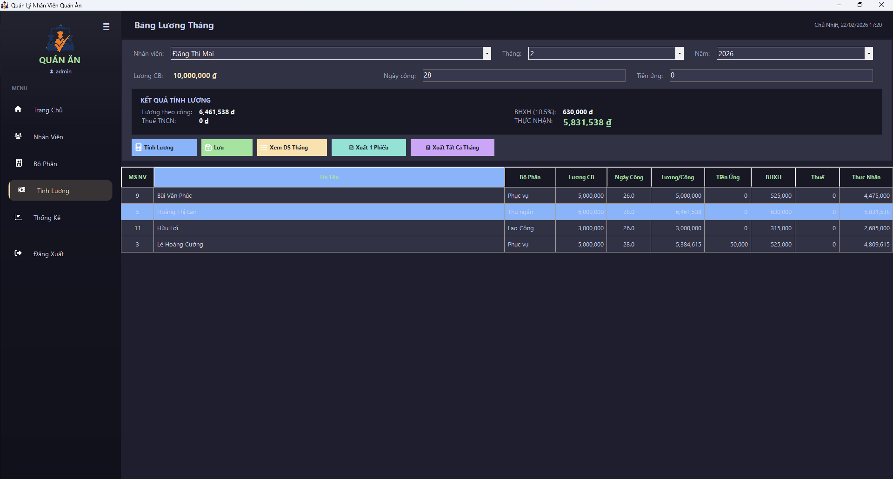
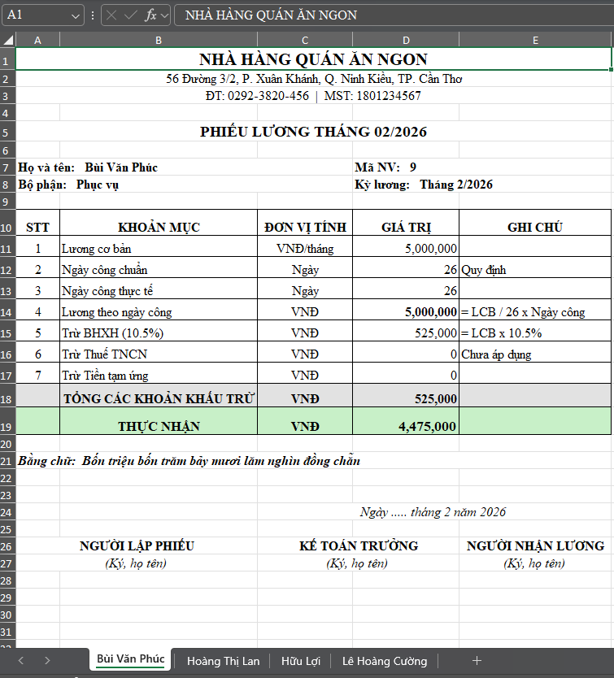
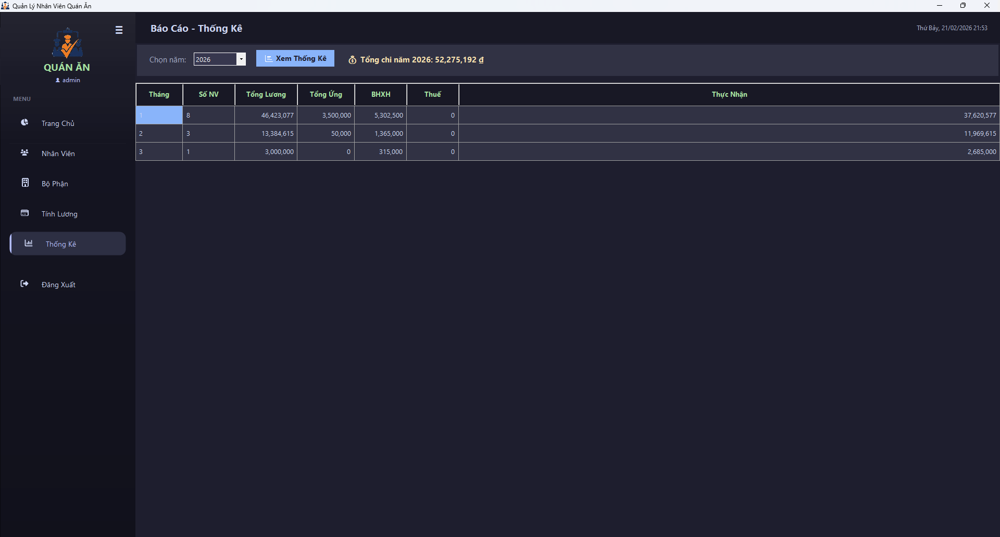

# 🍜 Quản Lý Nhân Viên Quán Ăn


## 📖 Giới Thiệu

**Hệ thống Quản lý Nhân viên Quán Ăn** là ứng dụng Windows Forms được xây dựng trên nền tảng **.NET Framework 4.7.2**, hỗ trợ quản lý toàn diện nhân sự cho nhà hàng & quán ăn: từ quản lý nhân viên, bộ phận, tính lương, cho đến **xuất phiếu lương Excel** chuyên nghiệp.

Ứng dụng sử dụng giao diện **Catppuccin Mocha** hiện đại với các Custom Control tự thiết kế (GlassPanel, RoundedButton, DashboardCard).

---

## ✨ Tính Năng Chính

| Tính năng | Mô tả |
|---|---|
| 👤 **Quản Lý Nhân Viên** | Thêm, sửa, xóa, tìm kiếm nhân viên. Lưu trữ chi tiết: họ tên, CCCD, SĐT, địa chỉ, lương cơ bản |
| 🏢 **Quản Lý Bộ Phận** | Tổ chức nhân sự theo bộ phận (Bếp, Phục vụ, Thu ngân, Lao Công...) |
| 💰 **Tính Lương & Bảng Lương** | Tính lương tự động: Lương cơ bản, ngày công, BHXH (10.5%), thuế TNCN, tiền ứng → Thực nhận |
| 📊 **Báo Cáo & Thống Kê** | Dashboard tổng quan, thống kê lương theo tháng/năm |
| 📄 **Xuất Phiếu Lương Excel** | Xuất 1 phiếu hoặc tất cả phiếu lương tháng ra file `.xlsx` bằng **ClosedXML** |
| 🔐 **Đăng Nhập Bảo Mật** | Hệ thống xác thực với mã hóa mật khẩu SHA-256 |
| 🔧 **Connection Wizard** | Tự động chẩn đoán & cấu hình kết nối SQL Server khi triển khai |
| 📝 **Logging Kép** | Ghi log hoạt động đồng thời vào File + Database (bảng ErrorLog) |

---

## 🛠️ Công Nghệ Sử Dụng

| Thành phần | Công nghệ |
|---|---|
| **Ngôn ngữ** | C# |
| **Framework** | .NET Framework 4.7.2 |
| **Giao diện** | Windows Forms (WinForms) + Custom Controls |
| **CSDL** | Microsoft SQL Server 2019+ |
| **Xuất Excel** | [ClosedXML](https://github.com/ClosedXML/ClosedXML) (MIT License) |
| **Icon** | [FontAwesome.Sharp](https://www.nuget.org/packages/FontAwesome.Sharp/) 6.6.0 |
| **Kiến trúc** | 3-Layer Architecture (Presentation → Service → Data Access) |
| **Bảo mật** | SHA-256 password hashing, DPAPI encryption, Parameterized SQL queries |

---

## 📂 Cấu Trúc Dự Án

```
QuanLyNhanVien/
├── Forms/                  # Giao diện người dùng
│   ├── FormLogin            # Đăng nhập
│   ├── FormMain             # Khung chính (sidebar + MDI container)
│   ├── FormDashboard        # Trang chủ tổng quan
│   ├── FormNhanVien         # Quản lý nhân viên
│   ├── FormBoPhan           # Quản lý bộ phận
│   ├── FormBangLuong        # Bảng lương + Xuất Excel
│   ├── FormThongKe          # Báo cáo thống kê
│   └── FormConnectionWizard # Cấu hình kết nối CSDL
│
├── Services/               # Tầng xử lý nghiệp vụ (Business Logic)
│   ├── BangLuongService     # Tính lương, lưu bảng lương
│   ├── NhanVienService      # CRUD nhân viên
│   ├── BoPhanService        # CRUD bộ phận
│   ├── TaiKhoanService      # Xác thực đăng nhập
│   ├── ThongKeService       # Thống kê báo cáo
│   ├── DashboardService     # Dữ liệu trang chủ
│   └── ServiceResult<T>     # Generic Result Pattern
│
├── DataAccess/             # Tầng truy xuất dữ liệu (ADO.NET)
│   ├── DatabaseHelper       # Quản lý connection string
│   ├── BangLuongDAL         # Truy vấn bảng lương
│   ├── NhanVienDAL          # Truy vấn nhân viên
│   ├── BoPhanDAL            # Truy vấn bộ phận
│   └── TaiKhoanDAL          # Truy vấn tài khoản
│
├── Models/                 # Các lớp thực thể dữ liệu
│   ├── TaiKhoan, BoPhan, NhanVien, BangLuong
│   └── KetQuaTinhLuong      # DTO kết quả tính lương
│
├── Infrastructure/         # Hạ tầng dùng chung
│   ├── ExcelExporter        # ⭐ Xuất phiếu lương Excel (ClosedXML)
│   ├── AppLogger            # Logging kép (File + Database)
│   ├── SecurityHelper       # Mã hóa SHA-256
│   ├── GridHelper           # Sắp xếp DataGridView
│   ├── GlobalExceptionHandler
│   ├── ConnectionDiagnostics
│   └── LoginSettings
│
├── Controls/               # Custom UI Controls
│   ├── GlassPanel           # Hiệu ứng kính mờ (Glassmorphism)
│   ├── RoundedButton        # Nút bo góc
│   └── DashboardCard        # Thẻ thống kê dashboard
│
├── SQL/                    # Script khởi tạo CSDL
│   ├── CreateDatabase.sql   # Tạo DB + bảng cơ bản (7 bảng)
│   ├── 002_ExpandSchema.sql # Mở rộng (Ca làm, Chấm công, Thưởng/Phạt)
│   └── 003_ErrorLog.sql     # Bảng ghi log lỗi
│
├── AppColors.cs            # Bảng màu Catppuccin Mocha
├── AppFonts.cs             # Cấu hình font chữ
├── AppIcons.cs             # Icon FontAwesome
└── Program.cs              # Entry point
```

---

## 🚀 Cài Đặt & Triển Khai

### Yêu cầu hệ thống

| Yêu cầu | Phiên bản |
|---|---|
| Hệ điều hành | Windows 10/11 hoặc Windows Server 2019+ |
| Runtime | .NET Framework 4.7.2 |
| Cơ sở dữ liệu | SQL Server 2019 Express trở lên |

### Cài đặt nhanh

```bash
# 1. Clone dự án
git clone https://github.com/duyphan0503/quan-ly-nhan-vien-quan-an.git

# 2. Mở trong Visual Studio → Restore NuGet Packages

# 3. Chạy SQL script theo thứ tự:
#    CreateDatabase.sql → 002_ExpandSchema.sql → 003_ErrorLog.sql

# 4. Build & Run (F5)
#    → Connection Wizard sẽ tự xuất hiện nếu chưa cấu hình DB
```

📘 **Hướng dẫn triển khai chi tiết:** [HUONG_DAN_TRIEN_KHAI.md](HUONG_DAN_TRIEN_KHAI.md)

---

## 📸 Hình Ảnh Demo

### Giao diện chính

| Đăng nhập | Dashboard |
|:---:|:---:|
|  |  |

### Quản lý dữ liệu

| Quản lý Nhân viên | Quản lý Bộ phận |
|:---:|:---:|
|  |  |

### Bảng lương & Xuất Excel

| Bảng lương tháng | Phiếu lương Excel |
|:---:|:---:|
|  |  |

### Thống kê báo cáo

| Thống kê & Báo cáo |
|:---:|
|  |

---

## 💡 Công Thức Tính Lương

```
Lương theo công  = Lương cơ bản ÷ 26 × Ngày công thực tế
BHXH             = Lương cơ bản × 10.5%
Thuế TNCN        = 0 (chưa áp dụng)
─────────────────────────────────────────────────────
THỰC NHẬN        = Lương theo công − BHXH − Thuế − Tiền ứng
```

---

## 📄 Xuất Phiếu Lương Excel

Tính năng xuất phiếu lương sử dụng thư viện **ClosedXML** (cài qua NuGet), code nằm trong `Infrastructure/ExcelExporter.cs`:

```csharp
// Xuất 1 phiếu lương của nhân viên đang chọn
ExcelExporter.ExportMotPhieu(bangLuong, filePath);

// Xuất tất cả phiếu lương trong tháng (mỗi NV = 1 sheet)
ExcelExporter.ExportTatCaPhieu(danhSach, thang, nam, filePath);
```

Phiếu lương được thiết kế theo mẫu chuyên nghiệp nhà hàng Việt Nam:
- ✅ Tên đơn vị + Địa chỉ + MST
- ✅ Thông tin nhân viên (Họ tên, Bộ phận, Mã NV)
- ✅ Bảng chi tiết 7 khoản mục lương có viền
- ✅ Dòng THỰC NHẬN nổi bật nền xanh lá
- ✅ Số tiền bằng chữ tiếng Việt (`DocSoTien()`)
- ✅ Phần ký xác nhận (Người lập, Kế toán, Người nhận)
- ✅ Khổ A4 Portrait, sẵn sàng in

---

## 📚 Tài Liệu Khác

| Tài liệu | Mô tả |
|---|---|
| [HUONG_DAN_TRIEN_KHAI.md](HUONG_DAN_TRIEN_KHAI.md) | Hướng dẫn triển khai chi tiết (DB, deploy, checklist) |
| [BI_KIP_GIAI_TRINH.md](BI_KIP_GIAI_TRINH.md) | Bí kíp trình bày & bảo vệ đồ án |

---

## 🤝 Đóng Góp

Mọi đóng góp đều được hoan nghênh! Vui lòng tạo Pull Request hoặc mở Issue nếu phát hiện lỗi.

## 📝 Giấy Phép

Dự án được phân phối dưới giấy phép **MIT**. Xem file [LICENSE](LICENSE) để biết thêm chi tiết.

---

<div align="center">
  <strong>© 2026 — Dự Án Quản Lý Nhân Viên Quán Ăn</strong><br>
  <em>Đồ án môn học — TP. Cần Thơ</em>
</div>
